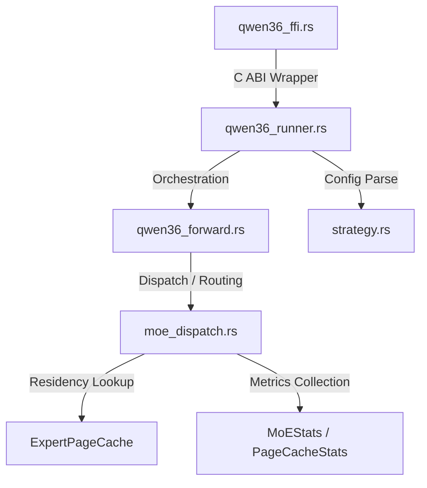

# Crate and Module Boundaries Specification

This document defines the strict architectural boundaries and responsibilities for each module within the `objeta-qwen36-executor` codebase. Adhering to these boundaries prevents the project from collapsing back into a single monolithic "God Object" architecture and ensures clean separation of concerns.

---

## 1. Module Responsibilities

### 1.1. `strategy` (Config Only)
- **Responsibility**: Parsing, representation, and validation of strategies (e.g. presets like `safe.json`, `fast.json`, `turbo.json`, `debug.json`).
- **Boundary Rules**:
  - Contains **only** state configurations and command line arguments parsing logic.
  - Must not depend on any inference variables, memory allocation states, or layer computation details.

### 1.2. `qwen36_forward` (Orchestration Only)
- **Responsibility**: Orchestration of the model forward pass (e.g., calling RMSNorm, GQA attention, MoE dispatch, and DeltaNet computation).
- **Boundary Rules**:
  - Acts purely as a pipeline coordinator.
  - Must not hardcode or implement cache evictions, routing algorithms, or file loading operations directly.

### 1.3. `moe_dispatch` (Expert Selection / Dispatch Only)
- **Responsibility**: Scoring router weights, performing top-p or contribution pruning, choosing which experts to execute, and invoking GEMV.
- **Boundary Rules**:
  - Translates input routing scores into selected expert lists based on strategy constraints (`min_experts`, `max_experts`).
  - Delegates storage residency checks directly to the `ExpertPageCache`.
  - Must not read strategy config files (JSON) directly; all strategy boundaries must be resolved at construction or passed via parameters.

### 1.4. `ExpertPageCache` (Residency Only)
- **Responsibility**: Maintenance of RAM pages, LRU eviction execution, and buffer references retrieval (`ensure_resident`).
- **Boundary Rules**:
  - Focuses solely on whether an expert's quantized weights are loaded in memory or need cold loading.
  - Knows nothing about attention heads, routing scores, token sequence length, or forward orchestration.

### 1.5. Stats / Metrics (Collection Only)
- **Responsibility**: Recording warm hit rates, bytes read, execution wall times, and formatting metrics telemetry (e.g., JSON output).
- **Boundary Rules**:
  - Passive data structure or atomic counters.
  - Must not modify execution policies or affect cache eviction behavior.

### 1.6. `ffi` / `qwen36_ffi` (C ABI Only)
- **Responsibility**: Flat C interfaces exposed to the Python runner (`lko_runner_*` APIs).
- **Boundary Rules**:
  - Handles pointer conversions, raw error boundary protection, and DLL export declarations.
  - Contains no core execution or config parsing logic.

---

## 2. Hard Prohibitions (禁止事項)

To preserve architectural integrity, the following implementation practices are strictly forbidden:

1. **Do Not Inline Cache Policies in `qwen36_forward.rs`**:
   - The forward orchestration must remain agnostic to eviction policies (like LRU) or capacity bytes limits. Any residency checks must delegate to `moe_dispatch` or the page cache itself.
2. **Do Not Load or Parse JSON Configurations inside `moe_dispatch.rs`**:
   - The dispatch module should consume pure primitive structs or structured strategy parameters passed from `qwen36_runner` or `StrategyConfig`. It must not perform I/O operations to read `.json` config files.
3. **Do Not Mutate Execution Policies inside Stats Collection**:
   - Stats collection hooks (e.g. latency tracking, bytes loaded counters) must be strictly read-only or side-effect-free relative to execution flow. They must not steer or mutate active thresholds, pruning modes, or routing masks.
4. **Do Not Add Model Semantics to Python Runner (`qwen36_full_rust.py` etc.)**:
   - The Python script is a wrapper/telemetry layer. It must not contain core ML operator specifications, matrix layout offsets, or expert routing arithmetic. All deep model heuristics must live on the Rust native side.
