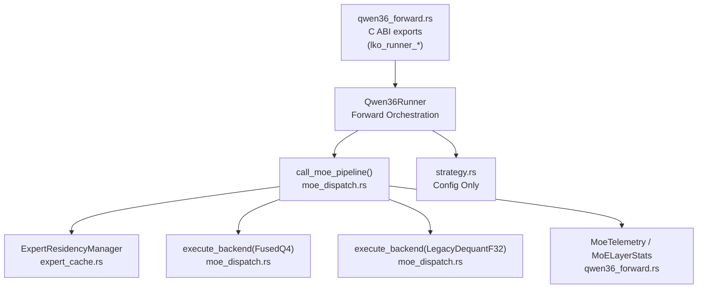

# Crate and Module Boundaries Specification

This document defines the strict architectural boundaries and responsibilities for each module within the `objeta-qwen36-executor` codebase.

---

## 1. Module Architecture



---

## 2. Module Responsibilities

### 2.1. `strategy` — Config Only
- **Responsibility**: Parsing, representation, and validation of strategy configs.
- **Boundary Rules**:
  - Contains only state configurations and CLI argument parsing.
  - Must not depend on inference variables, memory allocation, or layer computation.

### 2.2. `qwen36_forward` — Orchestration + C ABI
- **Responsibility**: Forward pass orchestration (RMSNorm, GQA, shared expert, MoE dispatch, DeltaNet). Hosts all `lko_runner_*` C ABI exports.
- **Boundary Rules**:
  - Acts as a pipeline coordinator. Calls `call_moe_pipeline` for all MoE execution.
  - Must not implement cache evictions, routing algorithms, or expert I/O directly.
  - All MoE expert residency decisions must flow through `ExpertResidencyManager`.

### 2.3. `moe_dispatch` — Expert Selection / Dispatch / Pipeline
- **Responsibility**: The canonical `call_moe_pipeline()` entry point, backend dispatch, routing, residency cache integration, and telemetry finalization.
- **Key Exports**:
  - `call_moe_pipeline()` — canonical single-pass orchestration
  - `execute_backend()` — dispatches to `FusedQ4` or `LegacyDequantF32`
  - `lko_moe_forward_layer()` — **deprecated** C ABI wrapper; delegates to `call_moe_pipeline`
  - `fused_moe_q4_selected_cached()` — low-level fused kernel
- **Boundary Rules**:
  - Must not read JSON config files directly.
  - Must not hold its own expert weight state (`CACHED_EXPERTS` is superseded by `ExpertResidencyManager`).
  - Legacy global `CACHED_EXPERTS` is deprecated; all expert pages flow through `ExpertResidencyManager` passed by reference.

### 2.4. `expert_cache` — Residency Only
- **Responsibility**: RAM-resident Q4 page management (`ExpertResidencyManager`). LRU eviction. `ensure_resident()`.
- **Key Types**:
  - `ExpertPageKey { layer_id, expert_id, precision }`
  - `ExpertPageMeta { bytes, last_used_token, use_count, ema_gate, load_count }`
  - `ExpertPage { gate_up_bytes: Arc<[u8]>, down_bytes: Arc<[u8]> }` — Q4-compressed bytes (NOT dequantized F32)
  - `ExpertResidencyManager` — resident HashMap + eviction
- **Boundary Rules**:
  - Pages are stored as compressed `Arc<[u8]>` — never pre-dequantized F32.
  - Knows nothing about routing scores, attention, or token sequences.
  - Eviction policy is currently LRU (`last_used_token`). Score-based eviction is a future upgrade.

### 2.5. `MoeTelemetry` / `MoeExecutionResult` — Canonical Result Type
- Defined in `moe_dispatch.rs`.
- `call_moe_pipeline()` always returns `MoeExecutionResult { output: Vec<f32>, telemetry: MoeTelemetry }`.
- Thin wrappers that only need `output` may extract it; telemetry is never hidden behind side effects.

### 2.6. C ABI Exports (`qwen36_forward.rs`) — Flat C Interfaces

| Symbol | Status | Description |
|--------|--------|-------------|
| `lko_runner_init(...)` | Active | Initialize runner with model weights |
| `lko_runner_forward(...)` | Active | One forward pass |
| `lko_runner_init_page_cache(runner, capacity_bytes)` | **Preferred** | Initialize residency cache via explicit runner pointer |
| `lko_moe_init_page_cache(capacity_bytes)` | Legacy | Singleton-based cache init (deprecated pattern) |
| `lko_runner_get_instance()` | **暫定互換** | Returns singleton runner pointer. Future: removed in multi-runner/daemon. |
| `lko_moe_forward_layer(...)` | **Deprecated wrapper** | Delegates to `call_moe_pipeline`. No independent execution path. |
| `lko_runner_selected_expert_q4_path(...)` | Active | Direct selected-expert execution via runner |
| `lko_runner_selected_expert_q4_fused(...)` | Active | Direct fused selected-expert execution via runner |
| `lko_runner_get_moe_stats_json()` | Active | Returns full stats JSON |

> Note: `qwen36_ffi.rs` was removed (stale, never wired to `lib.rs`). Canonical ABI lives in `qwen36_forward.rs`.

---

## 3. Hard Prohibitions (禁止事項)

1. **`Vec<f32>` resident cache**: Expert pages must be stored as compressed `Arc<[u8]>`. Never dequantize into F32 and keep resident — this expands memory 8×.
2. **Inline cache policy in `qwen36_forward`**: Forward orchestration must delegate residency entirely to `ExpertResidencyManager`.
3. **JSON config in `moe_dispatch`**: Dispatch module consumes passed-in strategy parameters only.
4. **Mutating execution from stats**: Telemetry counters must be strictly read-only relative to routing.
5. **Model semantics in Python runner**: `qwen36_full_rust.py` is a wrapper. No routing arithmetic, weight offsets, or expert selection logic.
6. **Forward math / routing / gate normalization changes**: Core model math is frozen. Only execution orchestration, caching, and telemetry may change.

---

## 4. Execution Flow (simplified)

```
lko_runner_forward()
  └─ qwen36_forward: for each MoE layer
       └─ call_moe [wall-timed]
            └─ execute_selected_moe()
                 └─ call_moe_pipeline()
                      ├─ router_topk_cpu()        [router_wall]
                      ├─ build Vec<SelectedExpert> [candidate_build_wall]
                      ├─ RuntimeDecision stub      [policy_select_wall=0]
                      ├─ ExpertResidencyManager    [cache_lookup_wall]
                      │    ├─ hit: warm_hit_count++, Arc<[u8]> clone
                      │    └─ miss: evict_until_fit(), load_fn(), insert
                      ├─ execute_backend()         [routed_exec_wall]
                      │    ├─ FusedQ4: fused_moe_q4_selected_cached()
                      │    └─ LegacyDequantF32: dequantize + f32_gemv
                      └─ finalize MoeTelemetry     [stats_wall]
```
