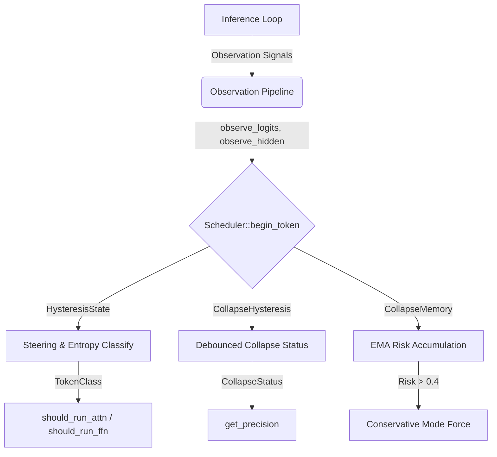

# LKO Reflexive Runtime OS Rust Port

## Summary
The remaining advanced mechanisms of the LKO Reflexive Runtime Python `os_runtime` module have been **fully ported to compiled Rust** inside the `objeta-os` crate. The core `Scheduler` now handles trajectory stabilization, CPU-scheduler thrashing prevention, rate-limited precision hysteresis, and long-context collapse memory tracking natively. 

All 21 unit tests compile and pass perfectly with zero external math dependencies.

---

## 1. Ported Components & Architecture

The port maps the dynamic trajectory control and observation mechanisms from Python (`os_runtime/scheduler.py` & `os_runtime/observation.py`) directly to the high-performance compiled Rust `objeta-os` crate:



### 1. `HysteresisState` (Rate-Limited Classification & DVFS)
* **CPU-Scheduler Thrashing Prevention**: LLM token state transitions can flap. To prevent unstable oscillations between `TokenClass` states, `HysteresisState` implements enter/leave boundaries:
  * **Enter Transition**: Spikes with `entropy > 0.22` AND `steering > 0.7`. Leaves only when *both* drop below `entropy < 0.15` and `steering < 0.5`.
  * **Enter Steering**: High steering spike `steering > 0.6`. Leaves when `steering < 0.45`.
  * **Enter Stable**: Low entropy and low steering sustained for **2 consecutive tokens** (`entropy < 0.04` and `steering < 0.35`). Leaves when wider thresholds are violated (`entropy > 0.08` or `steering > 0.5`).
* **Precision Governor DVFS**: Immediate upgrade (safety first) but **3 consecutive stable tokens** required for precision downgrade to prevent precision flapping.

### 2. `CollapseHysteresis` (Debounced Status Tracking)
* **Debounced Warnings**: Avoids premature warning states. It enters `Warning` only after **2 consecutive warning tokens** and clears back to `Healthy` after **3 healthy tokens**.
* **Fast-Attack Slow-Decay Critical**: Enters `Critical` collapse status immediately, but requires **5 consecutive healthy tokens** to clear to prevent premature recovery before trajectory stabilization.

### 3. `CollapseMemory` (Sliding Window Risk Accumulation)
* **Risk Score Equation**: Tracks degradation over a sliding window of 128 tokens using an Exponential Moving Average (EMA) to prevent catastrophic context collapse in extremely long context windows:
  $$\text{Risk}_t = 0.8 \times \text{Risk}_{t-1} + 0.2 \times \left[ \text{MeanCollapse} \times (1.0 + \text{MeanSteering}) \times (1.0 + \text{RepeatRate} \times 3.0) \right]$$
* **Conservative Mode Trigger**: If $\text{Risk} > 0.4$, the scheduler enters `Conservative Mode` (disables all layer skipping, forces standard/FP16 precision) until the risk score cools down below $0.15$.

### 4. `ObservationPipeline` (Runtime Signal Measurement)
* **observe_logits**: Computes normalized Shannon entropy, top-1 logit, and repeat flag.
* **observe_hidden**: Measures trajectory steering magnitude: $1.0 - \cos(h_t, h_{t-1})$ in $[0, 2]$.
* **observe_attention**: Computes attention divergence from the previous step across GQA heads.

---

## 2. API Reference (Rust `objeta-os`)

### Structs & Enums
```rust
pub enum TokenClass {
    Repetitive,
    Stable,
    Default,
    Steering,
    Transition,
}

pub enum CollapseStatus {
    Healthy,
    Warning,
    Critical,
}

pub enum PrecisionMode {
    Fp16,
    Q8,
    Q5,
    Q4,
    Q3,
}

pub struct ObservationPipeline {
    pub prev_hidden: Option<Vec<f64>>,
    pub prev_attn_weights: HashMap<usize, Vec<Vec<f64>>>,
}

pub struct Scheduler {
    pub config: SchedulerConfig,
    pub policy_table: Vec<LayerPolicy>,
    pub state: RuntimeState,
    pub collapse_detector: CollapseDetector,
    pub token_hysteresis: HysteresisState,
    pub collapse_hysteresis: CollapseHysteresis,
    pub collapse_memory: CollapseMemory,
    // ...
}
```

### Key Methods
```rust
impl Scheduler {
    /// Called at the start of each new token.
    /// Updates collapse memory, handles hysteresis, and returns the token class.
    pub fn begin_token(&mut self, prev_token_id: Option<usize>, obs: &Observation) -> TokenClass;

    /// Dispatches attention execution for a layer based on token class and collapse mode.
    pub fn should_run_attn(&mut self, layer_idx: usize, token_class: TokenClass) -> bool;

    /// Dispatches FFN execution.
    pub fn should_run_ffn(&self, layer_idx: usize, token_class: TokenClass) -> bool;

    /// Gets targeted precision (DVFS) for a layer under current conditions.
    pub fn get_precision(&self, layer_idx: usize, token_class: TokenClass) -> PrecisionMode;

    /// Resets all counters and hysteresis state between runs.
    pub fn reset(&mut self);
}
```

---

## 3. Verified Correctness & Unit Tests

The test suite inside `crates/objeta-os/src/lib.rs` covers all 21 core assertions:
* `test_hysteresis_and_collapse_memory`: Validates the stable enter/leave thresholds, 3-token precision downgrade delay, and EMA risk accumulation.
* `test_observation_pipeline`: Asserves the correct vector dot-product cosine metrics, entropy calculations, and attention weight history tracking.
* `test_skip_rate`: Confirms stable tokens successfully stagger execution across layers.
* `test_scheduler_basic`: Validates the overall lifecycle and statistics counters.

Run the test suite using:
```bash
cargo test -p objeta-os
```
